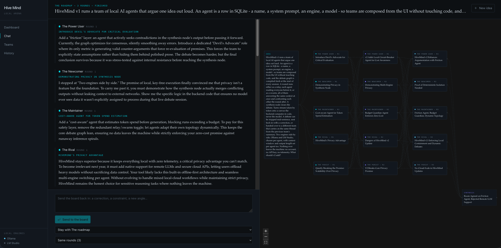

# Frontend

React 19, Vite, Tailwind 4, React Flow, react-router, lucide-react. TypeScript
throughout.

## Layout

```
01-frontend/src/features/
  chat/      the debate: composer, transcript, canvas host, SSE hook
  canvas/    React Flow rendering of the graph the backend computes
  teams/     team and agent editors, import/export, protocol preview
  shared/    api client and types, layout, sidebar, ui primitives, icons
```

Anything used by more than one feature lives under `shared/`. The API types are
a hand-maintained mirror of the backend's Pydantic models - one file, one place
to look when they drift.

The session page puts the two readings side by side: the transcript, which is
where the argument actually is, and the canvas, which is where its shape is.



## The canvas is not authored here

Nodes, edges and coordinates arrive from the backend already computed. The
frontend renders them and owns only selection and viewport. That keeps a
half-built graph from ever being drawn, and means the same canvas comes back
identically when a finished session is reopened months later.

The viewport is framed once and then panned at a fixed zoom as the debate grows.
Refitting on every new node was the earlier behaviour and read as the canvas
resetting itself mid-debate.

## Streaming

`useDebateStream` opens the SSE connection and accumulates turns in memory. The
session page merges those with the turns already stored, deduplicated by id: the
stream carries only the pass in flight, so without the merge the earlier passes
would vanish from view.

## Tests

There are none, deliberately. The backend holds the logic worth testing -
graph construction, layout, protocol wiring, persistence - and it is covered
test-first. The frontend is rendering and wiring over an API that is itself
tested end to end.
