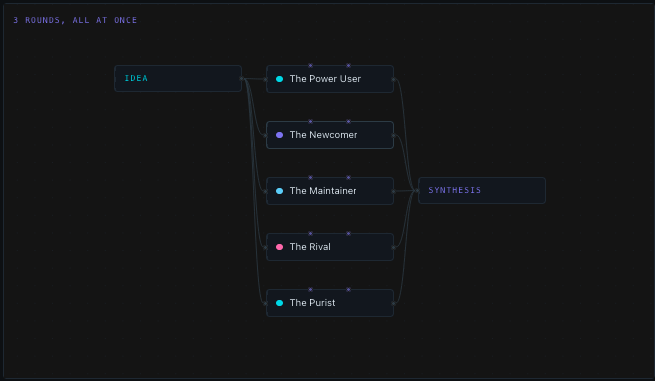

# Protocols: relay and swarm

`teams.protocol` is `relay` (the default) or `swarm`. It decides how a round is
wired, and nothing else.

```
relay   round_start -> A -> B -> C -> round_tick -> (loop | synthesis)

swarm   round_start -> A --+
        round_start -> B --+-> round_tick -> (loop | synthesis)
        round_start -> C --+
```

The team editor draws the shape before you run it, so a protocol is a picture
you pick rather than a word you remember:



## Relay - the assembly line

Each agent reads everyone before it, then speaks. Later agents are better
informed; they are also anchored by whoever spoke first. Good when the roles
build on each other - a strategist, then a producer costing the strategy, then a
copywriter working from both.

## Swarm - all at once, then confront

Every agent hangs off the same node, so LangGraph runs them in one superstep and
each sees the state as it was when the round began. That is precisely "do not
read your neighbours this round". From round two they read everything the
previous round produced.

With three agents and three rounds: round 1, all three answer the idea alone;
round 2, all three answer having read all of round 1; round 3, the same over
round 2. Independent opinions first, confrontation after.

Good when you want a vote or a spread of reactions that are not contaminated by
each other. A panel of personas is the clearest case: eleven people reacting
independently is a sample, whereas eleven people reading each other is a
bandwagon.

Parallel here is a graph property, not a promise of wall-clock speed: on one
machine that depends on the engine's own concurrency and on how much memory the
loaded models leave.

## On the canvas

A relay is drawn as one thread; a swarm as a mesh from each layer to the next.
Drawing a thread between agents of the same swarm round would be a lie - they
never read each other. Since a session can hand over to a team with a different
protocol, the canvas takes a protocol per pass and wires each half the way it
actually ran.

## Handover

A follow-up may name a different team, which then argues from that pass on. The
thread, the canvas and the summaries carry on; the interlocutors change. It is
how a panel feeds a desk without copying text by hand.

The incoming team reads the previous team's **synthesis**, never its transcript
- the rule that keeps small models afloat, and the reason a synthesis is an
interface rather than prose for the reader.
